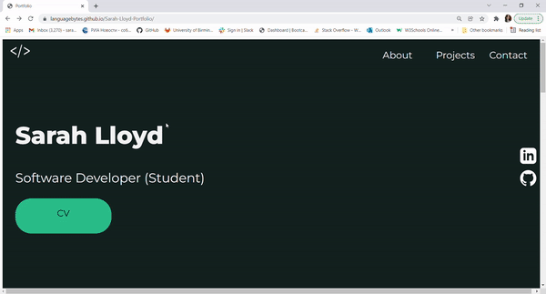

# 
 Portfolio 

## 
 Updated Version 

 
 

## 
  Original Version 

 
 

Link to deployed site: https://languagebytes.github.io/Sarah-Lloyd-Portfolio/

   Created using HTML, CSS and Javascript, the page contains a hero section, an about section, a projects section and a footer. I have added in anchor tags in the nav bar to direct the user to the relevant sections on the page. 
   When a project card is clicked, the user shall be directed to the github deployed site.  
   When the social icons are clicked, the user should be directed to the relevant social pages. 
   As I currently work in both the UK and Russia, I have created a Russian version of the page which is linked in the footer section. 

